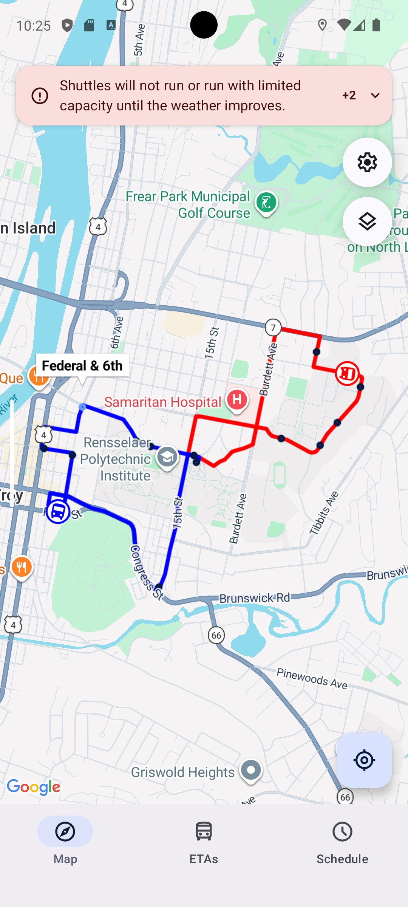
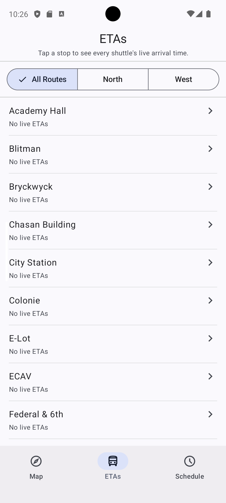
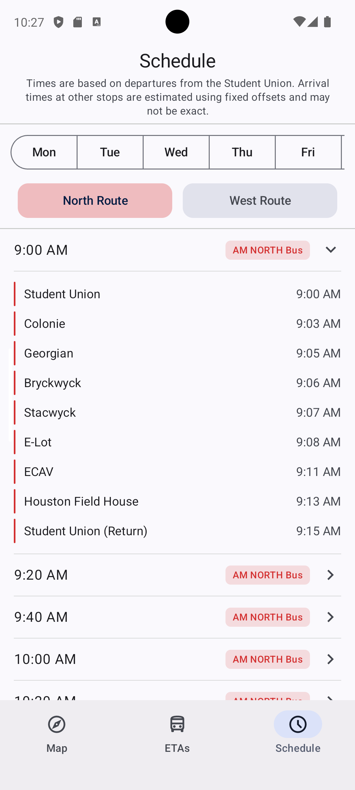
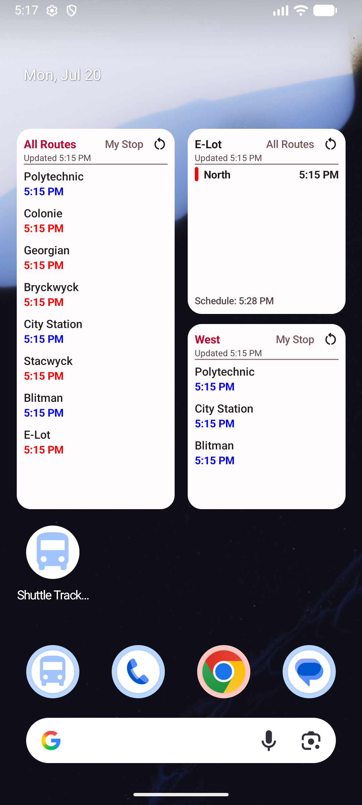

# Shuttle Tracker - Android

Shuttle Tracker is the Android app for RPI's real-time shuttle tracking system. It's the Android
client for [Shubble](https://github.com/Shubble-LLC/shubble) and talks to the same backend API,
showing live shuttle locations, routes, ETAs, and schedules in a native Android app.

## Screenshots

Show screenshots

 

| | |
|---|---|
|  |  |
|  |  |

## Features

- **Real-time tracking** - live shuttle locations on the map, polled every 5 seconds
- **Route visualization** - Google Map with route polylines and stops
- **ETAs** - live arrival time predictions per stop
- **Schedule** - browse the shuttle schedule by day and route
- **Push notifications** - Firebase Cloud Messaging for service announcements
- **Home screen widget** - live arrivals for all stops, or configure one stop for its full status, resizable from 2x2 up to 5x5

## Tech Stack

- **Language:** Kotlin
- **UI:** Jetpack Compose (Material 3)
- **Architecture:** MVVM with Hilt dependency injection
- **Networking:** Retrofit + kotlinx.serialization, talking to
  the [Shubble](https://github.com/Shubble-LLC/shubble) API
- **Maps:** Google Maps Compose
- **Local storage:** Jetpack DataStore (user preferences)
- **Widget:** Jetpack Glance + WorkManager

## New here?

- **[Installation](docs/INSTALLATION.md)** - set up Android Studio, clone the repo, and get the app running on an emulator.
- **[Architecture](docs/ARCHITECTURE.md)** - how the codebase is organized, so you know where to look (and where to add) code.

## Related Projects

- [Shubble](https://github.com/Shubble-LLC/shubble) - the main project; this app is a client of its API
- [Shuttle Tracker (iOS)](https://github.com/wtg/Shuttle-Tracker-SwiftUI) - the iOS app, same backend